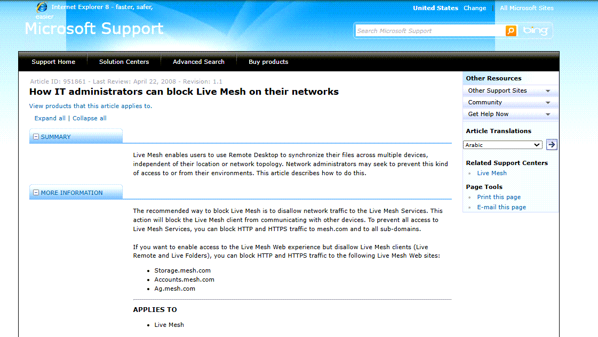

When i wrote about Live Mesh back in May, I asked myself what corporate security administrators would thnik about having their users starting meshing their private and business systenms.

In Microsofts KB951861 you find more information on how IT Administrators can block Live Mesh on their networks.
[http://support.microsoft.com/kb/951861/en-us](http://support.microsoft.com/kb/951861/en-us)

[Web Archive](https://web.archive.org/web/20100323011523/http://support.microsoft.com/kb/951861)

