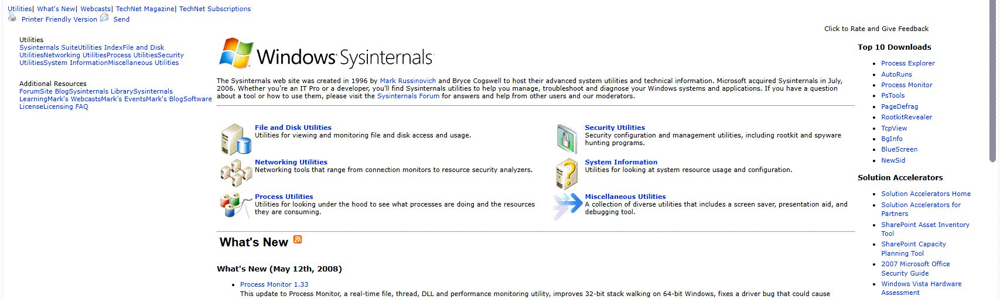

For those that need quick access to the famous sysinternals tools, direct access to the executables is now available through:
[http://live.sysinternals.com/](http://live.sysinternals.com/)

On Microsoft Technet, the tools can be found here:
[http://technet.microsoft.com/en-us/sysinternals/default.aspx](http://technet.microsoft.com/en-us/sysinternals/default.aspx)

[https://web.archive.org/web/20080513070655/http://technet.microsoft.com/en-us/sysinternals/default.aspx](https://web.archive.org/web/20080513070655/http://technet.microsoft.com/en-us/sysinternals/default.aspx)

