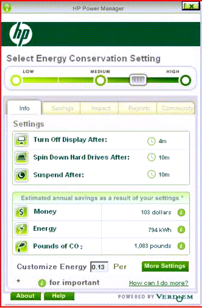

Everybody can help a little bit, turn off your TV from standby, and why not shutdown your home computer completely ?

On HPs latest client hardware, you'll find a nice little tool that helps you reduce energy costs as well, it's called the HP Power Manager.

The tool lets you select a power saving scheme and dows display as well the potential cost and energy savings, and most important how much you help saving the environment.I did just install a standalone version, but for large enterprises Verdiem provides an enterprise suite, that allows you centrally manage your users power settings. I'm just about to send them an e-mail to get a trial version, so hopefully i can let you more abuot this in a couple of days or so.

