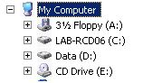
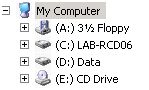

When launching Windows Explorer, by default the driver letters are being displayed behind the volume / share name.

Some people, like myself don't find this very convenient and want to see the drive letters in front of the volume / share description.  This can be customized by applying the following registry key:

Reg ADD HKLM\SOFTWARE\Microsoft\Windows\CurrentVersion\Explorer /v ShowDriveLettersFirst /t REG_DWORD /d 0x4 /f

