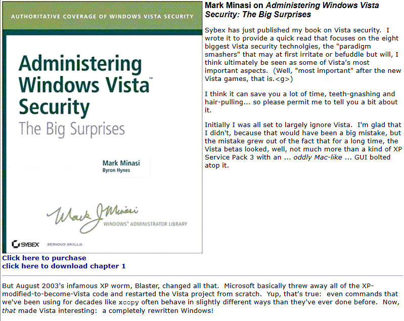

Although you usually don't read IT related books from page 1 and end it on the last page, I consider having finished reading [Mark Minasis'](http://www.minasi.com/) A**dministering Windows Vista Security - The Big surprises**.

While many IT books can end up being a bit annoying, i found this one very nice to read as it does include the authors own opinion and practical experiences and it does real fluently.

The book gives you a good insight into Vista's UAC, File and Registry virtualization and other security related topics.

Furthermore the books contains some practical examples including demonstration tools that can be downloaded from Marks' website to better understand how registry and file virtualization is working.

