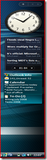

Once announced as one of the great new features in Windows Vista, it has become silent around the Sidebar gadgets. To me it looks like people have ran out of ideas about what could be *gadgetized*. 

  You find tons of Vista sidebar gadgets that display the weather, latest news, stocks, clocks and a whole range of search gadgets. Then there is another set of tools and utilities where most seem to focus on displaying some system information. 

                       From time to time i browse the gadgets galleries on [Windows Live Sidebar Gadgets](http://vista.gallery.microsoft.com/vista/SideBar.aspx?mkt=en) and today found the Outlook  Info gadget which i found somehow quite nice and useful.           
          
First i downloaded and installed it and as expected it then appeared in my sidebar, this actually started make me wondering where this thing got installed on the system.           
          
I quickly found out that the outlook.gadget installed itself by default under           
          
C:\Users\Alex\AppData\Local\Microsoft\Windows Sidebar          
          
hmmm, that's in my personal user folder, so what if i wanted this gadget to be available on the system for all users ??........ after a quick search i found the default Sidebar gadgets that come with Windows Vista being located under:           
          
C:\Program Files\Windows Sidebar\Gadgets          
          
So before thinking of the worse, I simply copied the gadget folder that was stored in my personal gadget location to the system gadget folder. Then opened the add gadget option in the side bar and saw the outlook gadget being displayed twice, so at least it had found it.           
          
I removed the gadget that was installed from my personal gadget location and then added the one stored on the system gadget location, and that worked fine.

