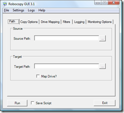

Some of you might now this already, I just came across this today :-) Although i prefer command lines, I must admit that i like this tool, as it allows you to either run the command immediately or save it as a script. And for some reasons I have always had a bit of a "typo" issue using robocoy. .

Read Article and download the tool here: [http://technet.microsoft.com/en-us/magazine/cc160891.aspx](http://technet.microsoft.com/en-us/magazine/cc160891.aspx)

