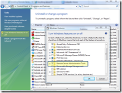

On Windows 2000/XP you used to install the adminpak.msi to get access to the various Administrator tools such as the Active Directory Users and Computers or the DHCP management interface.

With Windows Vista SP1, you must install the [RSAT](http://support.microsoft.com/kb/941314) package, RSAT stands for Remote Server Administrator Tool.

Once installed, I wanted to access them, so as I am used to do opened the Administrative Tools in the Start menu,.... but there weren't there....... ???

To keep the story short, you must first "enable" them before you can use them.

Open the Control Panel, select Programs and Features, then select the "Turn Windows Features on or off" option on the left side, then enable the RSAT tools.

A complete description about the RSAT installation has been posted here: [http://www.trainsignaltraining.com/windows-vista-rsat/2008-04-03/](http://www.trainsignaltraining.com/windows-vista-rsat/2008-04-03/)

