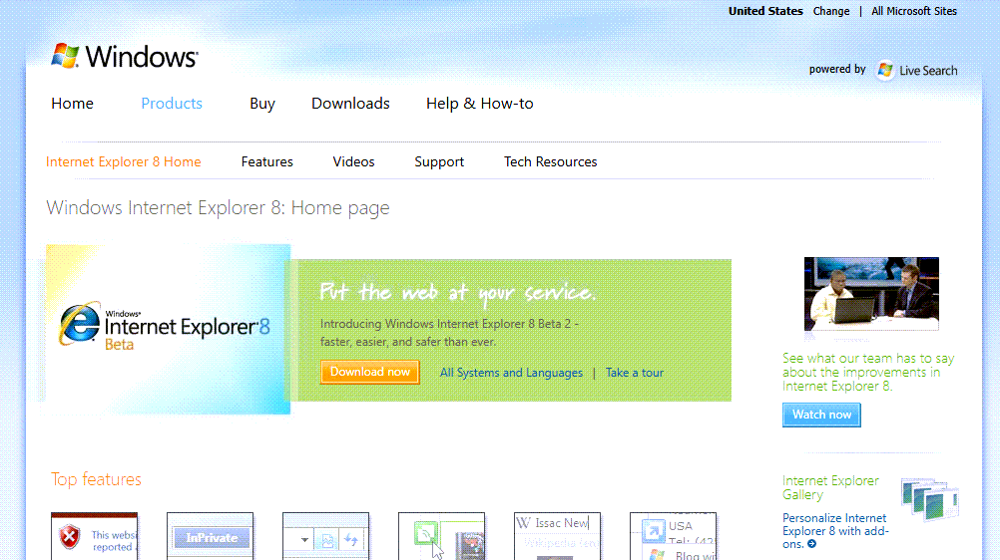

Earlier as planned, Microsoft has released Internet Explorer 8 Beta 2. A final release date has not been communicated yet.
[http://www.microsoft.com/windows/internet-explorer/beta/](http://www.microsoft.com/windows/internet-explorer/beta/)

