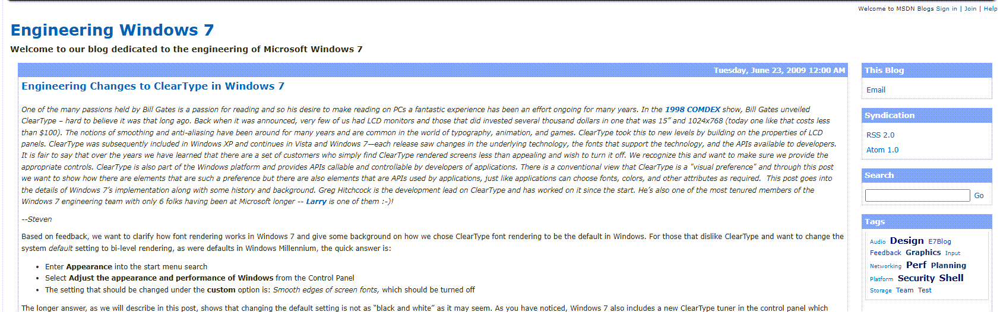

Looks like Microsoft has launched its first official blog that focuses on Windows 7. Read more here:

[http://blogs.msdn.com/e7/default.aspx](http://blogs.msdn.com/e7/default.aspx)

[Archive](https://blogs.windows.com/windowsexperience/tag/engineering-windows-7/)

