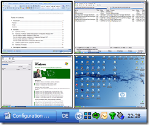

[Sysinternals](http://technet.microsoft.com/en-us/sysinternals/default.aspx) published a new nice utility called [Desktops](http://technet.microsoft.com/en-us/sysinternals/cc817881.aspx). Not that this is something we haven't seen before, but like all the tools from sysinternals it's all nicely packaged into one executable.

It's definitely worth a try. *Thanks Tobi for the hint :-)*

