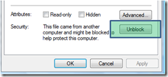
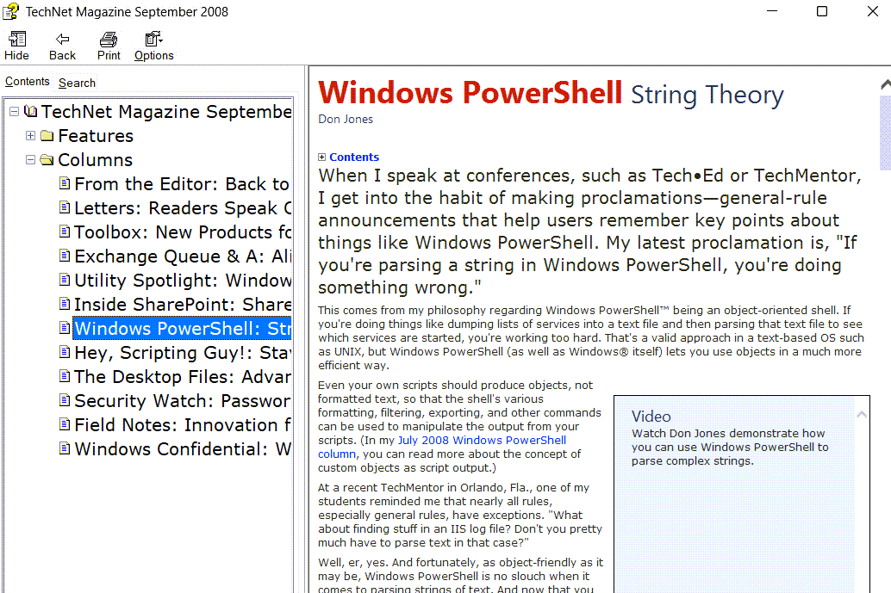

staying up to date is key when working in IT. As mentioned in an earlier post, i spend nearly 2 hours a day traveling to work and back home. Today i just noticed that [TechNet Magazine](http://technet.microsoft.com/en-us/magazine/default.aspx) is also made available as a HTML help file, so looks like i have another source for reading now.

[http://technet.microsoft.com/en-us/magazine/cc135917.aspx](http://technet.microsoft.com/en-us/magazine/cc135917.aspx)

Unfortunately the articles aren't consolidated in one file, but every months issue is made available in a separate download. The link below let's you download the September 2009 edition.

[http://download.microsoft.com/download/3/a/7/3a7fa450-1f33-41f7-9e6d-3aa95b5a6aea/TechNetMagazine2008_09en-us.chm](http://download.microsoft.com/download/3/a/7/3a7fa450-1f33-41f7-9e6d-3aa95b5a6aea/TechNetMagazine2008_09en-us.chm)

Should you have trouble reading the CHM files, select the file properties and select "unlock".

The reason is described here: [MS05-026: A vulnerability in HTML Help could allow remote code execution](http://support.microsoft.com/Default.aspx?kbid=896358)

