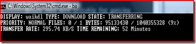
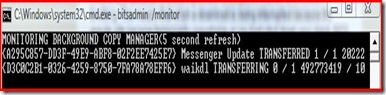

Today I have come across the topic BITS which stands for Binary Intelligent Transfer Service which is a file transfer technology that is included in Windows XP, Windows Server 2003 and Windows Vista.

What is nice about BITS is that it provides Checkpoint recovery and network throttling. This means that when a download is being interrupted because the remote site became temporarily unavailable or you had shut down your client, BITS will automatically resume the download when the remote source becomes available again or when the machine has been powered up again.

If other resources on the system have network activity , BITS automatically adjusts its use of the available network bandwidth.

If you have Windows Update enabled and download your updates from Microsoft or from a local WSUS server, the operating system uses BITS to retrieve the Windows Patch installation sources.

For more information about [BITS](http://msdn.microsoft.com/en-us/library/aa362708(VS.85).aspx) have a look on Microsoft MSDN.

Before you can use BITS yourself on XP and Server 2003, you must download BITSADMIN.EXE, that is included in the [Windows Server 2003 Service Pack 1 32-bit Support Tools](http://www.microsoft.com/downloads/details.aspx?FamilyId=6EC50B78-8BE1-4E81-B3BE-4E7AC4F0912D&displaylang=en). On Windows Vista bitsadmin version 3.0 comes with the OS.

For an overview of all available commands type BITSADMIN /? The syntax is quite straight forward.  Note that as far I know there is no scripting interface for BITS, so you must use the BITSADMIN.EXE tool to perform BITS tasks.

To download Microsoft Windows Automated Installation Kit sources (992 MB) you would enter the following command:

bitsadmin /TRANSFER waikdl [http://download.microsoft.com/download/8/6/d/86d6ba9c-98ff-444e-87ed-3e76772eb2a6/vista_6000.16386.061101-2205-LRMAIK_EN.img](http://download.microsoft.com/download/8/6/d/86d6ba9c-98ff-444e-87ed-3e76772eb2a6/vista_6000.16386.061101-2205-LRMAIK_EN.img) C:\transfer\waik.img

if you want to monitor any BITS activity on your system then type:

bitsadmin  /MONITOR

