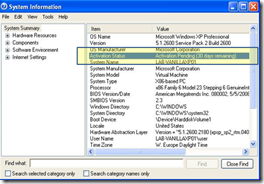

Within at least every second implementation project I work on, people get nervous about Windows XP reporting that the system is not yet activated, although their Windows XP client image was build using an enterprise volume license key.

When you run msinfo32.exe as as a standard user (without administrative rights), it does report the following:

But no worries, if you run msinfo32.exe with an administrative account, the message does not show up.

So what's up ? Well, standard users have no permission to query the systems activation status. This is behavior by design and is documented within the [Microsoft KB Article 817025.](http://support.microsoft.com/kb/817025/en-us)

