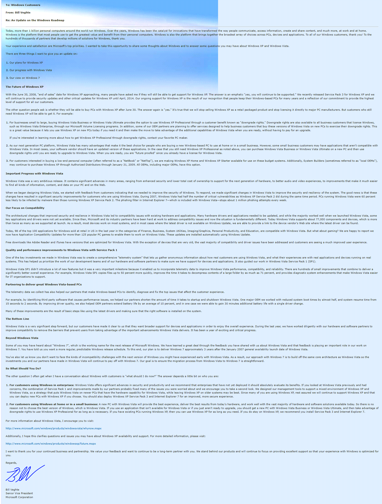

In a letter to enterprise customers Senior Vice President Bill Veghte at Microsoft informs customer about extended availability of Windows XP. Microsoft will continue to support Windows XP and release security updates until 2014.

Read more here: [http://www.microsoft.com/windows/letter.html](http://www.microsoft.com/windows/letter.html)

