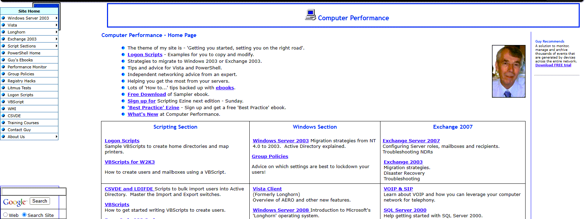

While searching for something I came across the site [computer performance](http://www.computerperformance.co.uk/index.htm), why the sites is called like that, i don't know, but it has a lot of interesting content related to windows 2008, vista, scripting etc. so that i find it worth mentioning.

