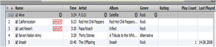
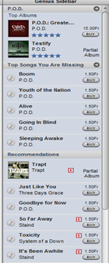

With [iTunes 8](http://www.apple.com/itunes/whatsnew/) Apple has added a new feature called Genius. when playing music the genius sidebar shows you related artists and songs.

So while playing the first song of this playlist.......

it does automatically show me the following related artists and songs.

the idea is not new, but i like to see it being added to iTunes.

