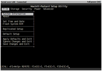
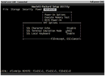
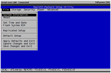

When remotely accessing the system BIOS of a HP Compaq dc7800 desktop machine using vPro, the BIOS appears in black and white as shown in the picture below:

to get the native BIOS colors you must configure the terminal emulator mode to ANSI

then, the BIOS will appear with colors as if you were sitting in front of the physical machine.

Thanks to Claude Henchoz for the hint.

