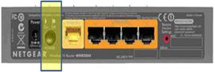

This is what i have been looking for since a while, about 12 months ago i was actively searching for a Wireless router with a power on/off button, but with no luck.

Yesterday i read a local IT magazine where there was a reference to a [Netgrear](http://www.netgear.com/Products/RoutersandGateways/WirelessNRoutersandGateways/WNR2000.aspx) Wireless Router that has a power on/off button.

I find having a power on/off button very useful for 2 reasons:

	
- Energy saving
	
- Less Wireless signals in the house when not needed

Till now the family just unplugged the power cable , but that isn't as convenient as just pressing a button, so soon this device will replace our current one.

