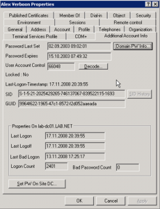

The Windows 2003 Resource Kit contains a nice extension for the Active Directory Users and Computers console showing additional User Account information.

The additional user account information can be enabled by registering the acctinfo.dll as described below.

Follow the steps below to enable the additional user account information.

	
- [Download](http://www.microsoft.com/downloads/details.aspx?familyid=9d467a69-57ff-4ae7-96ee-b18c4790cffd&displaylang=en) the Windows 2003 Resource kit tools.
	
- Unpack / Install the Windows 2003 Resource Kit
	
- Copy the acctinfo.dll to c:\windows\system32
	
- Register the DLL by running the following command:

*regsvr32 C:\windows\system32\acctinfo.dll*

	
- Launch the Active Directory Users and Computers management console, then select a user object and select the Additional Account Info tab.

