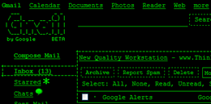

For all those that are missing the days when computer screens appeared in terminal mode, Google's GMail can now be configured like that. Just select Settings, Themes and select the "Terminal" theme.

