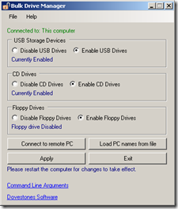

Easily and quickly disable USB Storage Drives, CD and Floppy drives across the network.  The tool can be executed in GUI and command line mode.

The tool is actually just configuring the appropriate system services , therefore after applying a configuration setting, the system must be rebooted so that the change can take effect.

The tool can be [downloaded](http://www.dovestones.com/products/usb-drive-manager/disable-usb-cd-floppy-drives.html) from [dovestones software](http://www.dovestones.com/).

