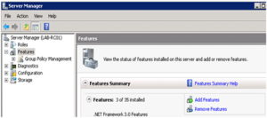
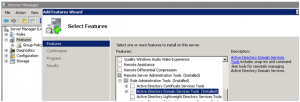
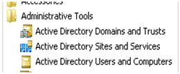

I just connected to our fresh installed Windows 2008 server that we intend to use as a remote system management console. The server is a member of our Windows 2003 Active Directory domain, not a DC itself.

I wanted to launch the Active directory users and computers console, but did not find it under the Administrative tools. Okay, this must be something similar like with [Windows Vista when you install the RSAT tools](https://www.verboon.info/?p=97) I thought, and yes it is, you must first enable that feature.

First, on the windows 2008 system open the server manager. Then select Features, Add features as shown in the picture below.

then select Remote Server Administration tools, Role Administration tools, and then enable Active Directory Domain Services Tools. (*note the screen shot below was taken after installation, that is why it is shown as installed*).

 

confirm the following message boxes and after a while (including a system reboot) the tools are installed and ready to use. Enjoy AD administration !

 

Also note that if you want to access the Group Policy Management Console, you must follow the same path, just look out for the GPMC console in the available features list.

