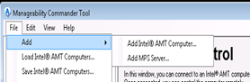
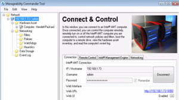
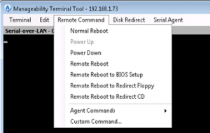
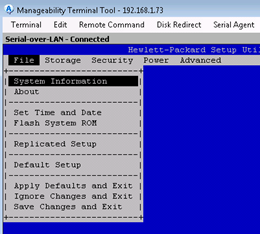

For those of you who do have vPro capable machines in their environment, but never had the chance to take a closer look at the AMT features, this blog post might be of interest.

For most people I assume the biggest hurdle to start using the AMT technology is that you need a System Management Infrastructure setup that provides AMT support like Microsoft SCCM, Altiris Client Management Suite, Intel Landesk or the HP System Configuration Management Suite. If you really plan to use the AMT technology , this of course is a prerequisite, but if you just want to explore the basic functionality of AMT there is an easier path.

From the Intel website you can download the [Manageability Developer Tool Kit](http://software.intel.com/en-us/articles/download-the-latest-version-of-manageability-developer-tool-kit)that is provided by Intel for 3rd party software developers that want to integrate Intel vPro support into their products.

Part of the Manageability Developer Tool Kit is the Manageability Commander Tool. It is exactly this tool that can give you that first real world experience you are after to see AMT in action.

	
- Gather PC hardware inventory data
	
- Remote BIOS administration
	
- Remote Reboot to a redirected DVD
	
- Remotely power up and power down a machine

To start with the first AMT experience you need the following:

	
- Both clients must be connected to the network
	
- The client you want to manage must be vPro enabled
	
- Configure the vPro machine to run in SMB mode, for more details on how to configure the AMT options, refer to your hardware vendor provided configuration manual. On HP business desktops, you would boot the client and then press Alt+P to load the vPro configuration menu..
	
- On the second PC that runs Windows XP or Vista you install the Intel Manageability Developer Tool Kit.
	
- Launch the Manageability Commander Tool and add your vPro client to the console as shown in the picture below.

 
	
- Connect to the device by clicking on the Connect button.
	
- Once connected you can start using some AMT functionality that is provided through the console.

  
	
- Go to the "Remote Control" tab and select take control. The Manageability Terminal tool window will open as shown in the picture below

 
	
- Then click for example on Remote Reboot to BIOS setup, then after a while you should see the system BIOS configuration screen appearing.

 

For the rest I suggest, just navigate through the tool and try out the other features yourself, For more demos do a search on Youtube, there are plenty of feature demo videos around vPro and AMT there such as the video below.

Hope you enjoy IT

