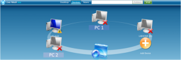
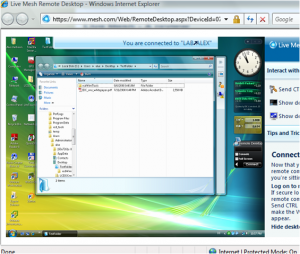
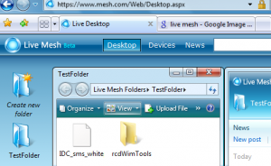

It's been in May this year that i first wrote about Microsoft Live Mesh, later in July I was able to get it installed and since then i have been using it on a regular basis.

Not that there is anything new in remote controlling a PC and sharing documents, but it is the simplicity how it is done and how it can be used.

Once you have added your clients to live mesh, you can remotely access them from anywhere where you have Internet access and the necessary permissions to install an ActiveX control. Note that you can also access your mesh clients from a PC that is not part of your mesh network, you just need to logon on mesh.com

All clients that are part of your mesh network have the Live Mesh Agent installed, this then adds an additional tray icon to your windows taskbar which allow you to directly access any live mesh devices, folders and the desktop.

 

Performance is quite ok and allows reasonable remote working, but i recommend to configure the Windows Vista Desktop to Vista Basic or Windows Basic, this will prevent the annoying screen painting effect.

 

Another great feature is the Live Mesh Desktop. Here you can create folders that if needed can be replicated across all your clients that are part of your mesh network. I personally use this feature often to simply move a file from one client to another, or I drop a document in there I want to continue reading on my home PC. 

 

At present a limited tech preview is also available for [Mac](http://on10.net/blogs/larry/First-Look-Live-Mesh-Client-for-Mac/) clients and the [CTP for Mobile](http://blogs.msdn.com/livemesh/archive/2008/12/09/expanded-live-mesh-for-mobile-ctp.aspx) devices has just been expanded as well. In general I am rather sceptic about the whole Cloud hype, but Live Mesh is definitely a cool innovation that we will most likely will hear and see more about in the near future.

