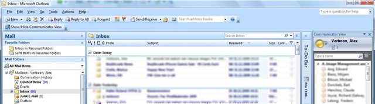

Those of you who work with Microsoft Outlook 2007 and Office Communicator 2007 might be interested in this one.

On the [MSDN code Gallery](http://code.msdn.microsoft.com/Communicator4Outlook) you can find a Communicator Add In for Outlook 2007. Instead of switching between the two applications, the Add In embeds your Office Communicator contacts in Outlook 2007 as shown in the picture below. 

