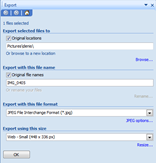
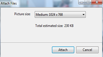
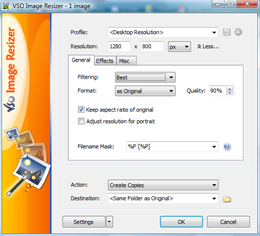

Just surfing a bit on the Internet, i get a Skype call from our friends who live in Perth Australia and asking me how to reduce the size of pictures before sending them via e-mail.

If you have Microsoft Office 2007 installed, images can be easily resized using the build-in export function.

 

An easy to read [step by step guide](http://www.towson.edu/adminfinance/OTS/training/documentation/Picture%20Manager/Picture_Manager2003.pdf) for Microsoft Office Picture Manager can be found on the Towson University site.

Another option is to use the [Windows Photo Gallery](http://www.microsoft.com/windows/windows-vista/features/photo-gallery.aspx) application that ships with windows Vista.

 

When having selected a picture and then push on the email button you can define the size of the picture before it gets attached to a new email.

 

In case nothing happens after you select the Attach button, check your default e-mail program settings as described here: [http://www.winhelponline.com/articles/241/1/E-mail-button-in-Windows-Photo-Gallery-does-nothing.html](http://www.winhelponline.com/articles/241/1/E-mail-button-in-Windows-Photo-Gallery-does-nothing.html)

And finally, if you aren't happy with all the build-in options Windows Vista provides you with, there is 3rd party software that can help as well in reducing picture file size. An easy to use utility i found is [VSO Image Resizer](http://www.vso-software.fr/products/image_resizer/image_resizer.php). The software is free for non commercial use and comes with a very easy to use user interface.

 

with just a few clicks the original picture that has 709 KB file size was reduced to 172 KB.

Note that all I wrote here was based on using Windows Vista, Windows XP users want to have a look at the [Windows Power Toys for Windows XP](http://www.microsoft.com/windowsxp/Downloads/powertoys/Xppowertoys.mspx) that contains a image resizer as well.

