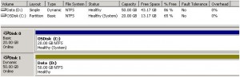
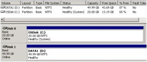

First let me avoid confusion here, I'm not talking about "dynamically expanding" discs but about the disc type e.g. [Basic and Dynamic](http://www.petri.co.il/difference_between_basic_and_dynamic_disks_in_windows_xp_2000_2003.htm).

In the past weeks we have been migrating some of our physical servers into Hyper-V. Just before X-mas my colleague had prepared a plain Windows 2003 system for me so that i could continue with installing the necessary applications that were planned to run on that system. Two discs were created, the primary disc that contains the boot partition is connected to an IDE controller and the second disc to a SCSI controller.  Note that the OS boot disc must always be connected to an IDE controller. So the disk layout looks as following:

Here comes the issue we ran in..... Upon every system reboot Windows lost the second DATA disc. and it would only come back after manually reactivating the disc within the disc management console. After some web searches i came across the following Microsoft Knowledge Base article that explains this behaviour: [SCSI disks are disconnected in the child partition of Hyper-V](http://support.microsoft.com/kb/558126).

The problem was related to the fact that the DATA disc was configured as a "dynamic" disc ^so we had to change that to a basic disc. Since you can't convert a dynamic disc to a basic disc without data loss (unless you follow [this non-supported hardcore method](http://faq.arstechnica.com/link.php?i=1806)) a second BASIC disc had to be created and the data needed to be copied from the old DATA disc to the new one. Once completed the dynamic disc can be deleted. In the end the disc layout looks as following.

All works fine now, and discs don't get disconnected after a system reboot. Leasson learned: Don't use dynamic discs in Hyper-V.

