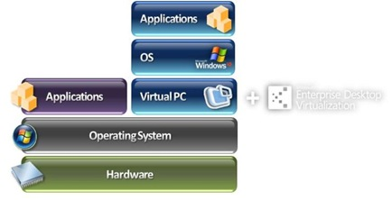

Microsoft Enterprise Desktop Virtualization (MED-V) is Microsoft's new product offering for so-called local virtualization or client based virtualization. The solution itself originates from Kidaro that was acquired by Microsoft last year.

With local desktop virtualization a complete OS is executed on top of the operating system that is installed on the users physical device. Using a client based virtualization solution such as MED-V can help with application compatibility issues when migrating to a new operating system. With MED-V you can continue providing applications to your users in a seamless way without having the user notice that that application runs on another virtualized OS.

One very interesting scenario that is being shown in the demo is the following: Assume you plan to migrate to Windows 7 that comes with Internet Explorer 8, but you have a business critical application that would only run on Internet Explorer 6. With MED-V you can provide IE6 to your end users running on Windows XP.

Find out more about MED-V from the links provided below:

[MED-V Power Point Presentation](http://download.microsoft.com/documents/uk/technet/postevent/11-11-2008/Med-V_forVirtualizationUnplugged.pptx)

[Microsoft Desktop Virtualization](http://www.microsoft.com/virtualization/solution-tech-desktop.mspx) on [Microsoft Virtualization](http://www.microsoft.com/virtualization/default.mspx)

MED-V [Demo](http://www.microsoft.com/virtualization/assets/media/chv/local/1.asx)

[Client-Hosted Virtualization with Microsoft Enterprise Desktop Virtualization product introduction](http://www.microsoft.com/virtualization/assets/media/chv/local/index.htm)

[WindowsIT Pro Magazine](http://windowsitpro.com/) MED-V [article](http://windowsitpro.com/article/articleid/101135/q-what-is-microsoft-enterprise-desktop-virtualization-med-v.html)

[Windows Springboard Series: Microsoft Enterprise Desktop Virtualization (MED-V)](http://www.microsoft.com/downloads/details.aspx?familyid=e39b3b58-528f-4dca-b908-112eba35d16f&displaylang=en&tm#filelist)

