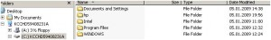

Those of you who are familiar with desktop engineering know the pain of scripting Windows configuration settings. While in general many settings can be configured by adding or changing a specific registry key value, there are still many things within the OS where Microsoft did not make our life as easy and provides a single registry key that can be tweaked.

Yesterday I worked on setting the Windows XP Windows Explorer View to "Details" by default for all users. The typical approach in identifying registry changes is to create a snapshot before and after manally applying the system configuration change, then in most cases the necessary registry keys are found and can be scripted. But unfortunately that wasn't the case when changing the Windows Explorer View to Details.

It's a long time ago I had the last request to apply this configuration to build, and back in 2004 I wasn't able to find a nice solution, so i ended up importing a couple of registry strings that did the thing, but I wasn't happy about as it was a huge REG_BINARY string that could contain more than just the Details View Setting.

So I made a new attempt in searching for a good solution, others might have found to configure this setting, and I found one that works great on: [http://groups.google.com/group/microsoft.public.windowsxp.general/msg/1327cd4eb34fc050](http://groups.google.com/group/microsoft.public.windowsxp.general/msg/1327cd4eb34fc050)

I have embedded the described registry keys within the following REG ADD commands, so that i can be used within an automated scripted client build process.

REG ADD "HKLM\SOFTWARE\Microsoft\Windows\Shell\Bags\AllFolders\Shell" /v WFlags /t REG_DWORD /d 00000000 /f 

REG ADD "HKLM\SOFTWARE\Microsoft\Windows\Shell\Bags\AllFolders\Shell" /v Status /t REG_DWORD /d 00000000 /f 

REG ADD "HKLM\SOFTWARE\Microsoft\Windows\Shell\Bags\AllFolders\Shell" /v Vid /t REG_SZ /d "{137E7700-3573-11CF-AE69-08002B2E1262}" /f 

REG ADD "HKLM\SOFTWARE\Microsoft\Windows\Shell\Bags\AllFolders\Shell" /v Mode /t REG_DWORD /d 00000004 /f

 

