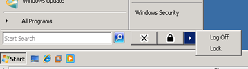
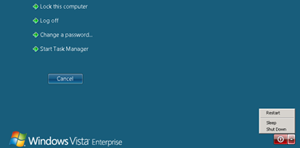
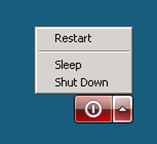
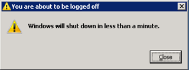

When you are logged on to a Vista Client through a remote desktop connection, you don’t see the option to shutdown or reboot the system within the Start Menu.

 

But if you are within the remote session and press CTRL+ALT+END you get the following screen

allowing you to Restart, shutdown or putting into sleep the system.

Another option is to enter the shutdown command at command prompt like shutdown /s that will shutdown the system.

