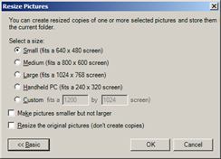

I blogged earlier about [Image resizer utilities](https://www.verboon.info/index.php/2008/12/tooltip-image-resizer/), but just found another one worth mentioning.

[Image Resizer Powertoy Clone for Windows](http://www.codeplex.com/PhotoToysClone) is as its name says a clone of the Windows XP Image Resizer Powertoy that runs on Windows Vista as well, in both 32 and 64 bit version.

Once installed the utility adds an entry into the file context menu "Resize Pictures".

Enjoy

