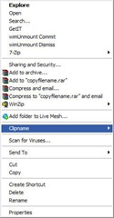
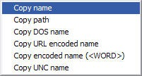

Today I was writing an email that contained a couple of file name references, as i was writing the first 2 file names I remembered that in the past when I used WinBatch there was a nice explorer context menu enhancement that allowed copying file names and paths into the windows clipboard.

By searching the web for filename to clipboard utilities, i actually found quite a lot of them. Because i prefer small, lean and FREE I finally ended up with [Clipname](http://www.mainsoft.fr/Files/clipname.zip) provided by [MainSoft](http://www.mainsoft.fr/).

Unlike other software that come with a complete setup wizard, clipname just consists out of 2 files. Clipname.dll and clipname.inf. Simply select the clipname.inf file and choose install , then you’re ready to go.

When selecting a folder, file or multiple files, the context menu will show you an extra Clipname option, allowing you to copy the name of the selected items to your Windows clipboard.

 

