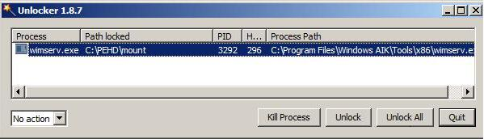

When trying out the Beta AIK for Windows 7 I got into a situation where some files got locked by the system, probably due to a not properly unmounted WIM file. A tool that has become most handy to unlock files is UNLOCKER.  [Unlocker ](http://ccollomb.free.fr/unlocker/)integrates itself into the context menu, so that you can easily select a folder or file that you want to unlock.

Unlocker can be downloaded directly from the developers [website](http://ccollomb.free.fr/unlocker/#download).

