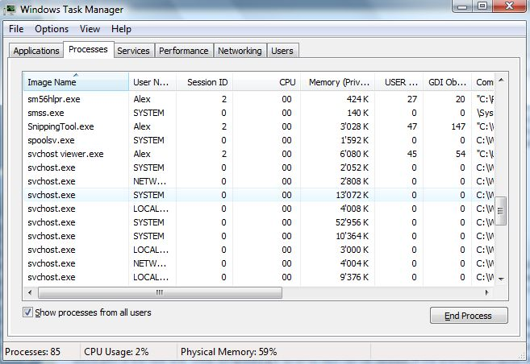
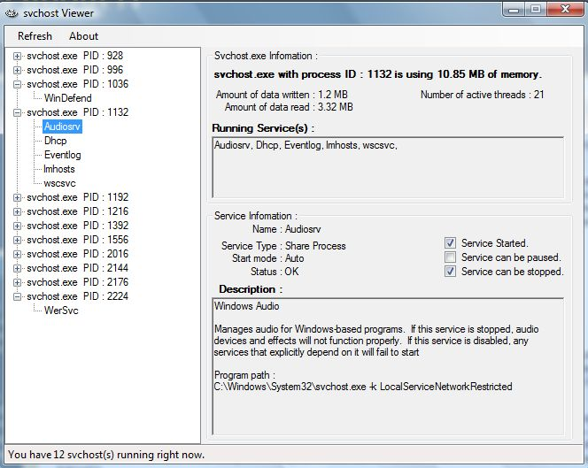

When you open the Windows Task Manager and select the Processes tab and then select the "show processes from all users" button, you will find many instances of the [svchost.exe ](http://support.microsoft.com/kb/314056/en-us)as shown in the picture below.

So what are all these svchost.exe doing ? To get a detailed overview of each running svchost.exe you can run the follwing command at the command prompt that will list each svchost process its PID and the running services.

tasklist /svc /FI "IMAGENAME eq svchost.exe"

The [SVCHOST Viewer](http://www.codeplex.com/svchostviewer), that can be downloaded from [Codeplex ](http://www.codeplex.com/)provides you with even more details such as the memory used, the running services including a description of the service  and the current service status.

of course you can also launch the [sysinternals process explorer ](http://live.sysinternals.com/procexp.exe)that can provide detailed svchost process informationn as well.

