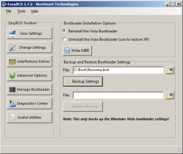

Before Windows Vista Boot Configuration Information was stored within the boot.inifile. With the introduction of Windows Vista Microsoft has completely reengineered the boot environment and Windows startup process. . Since then Boot Configuration information is not stored within the boot.ini anymore but within the BCD store. BCD = Boot Configuration Data.

To learn more about BCD read the following articles:

	
- [Boot Configuration Data in Windows Vista](http://www.microsoft.com/whdc/system/platform/firmware/bcd.mspx)
	
- [BCDEdit Commands for Boot Environment](http://www.microsoft.com/whdc/system/platform/firmware/bcdedit_reff.mspx)

To modify the content of the BCD Store, Microsoft has included bcdedit.exe as part of the Operating System,a command line tool to modify the BCD store. Using BCDEDIT can be quite a challenge and incorrect changes can result in a non-booting system. So if you plan to play around with BCDEDIT I strongly recommend that you first create a backup of your  BCD by typing the following command:

BCDEDIT /EXPORT C:\BACKUP\BCDORG.BCD

Now for those of you who prefer using a GUI to edit the BCD store I recommend using [EasyBCD](http://neosmart.net/dl.php?id=1)provided by Neosmart Technologies. EasyBCD provides a nice GUI to modify, backup and restore your Boot Configuration Data and IT'S FREE !!
 

