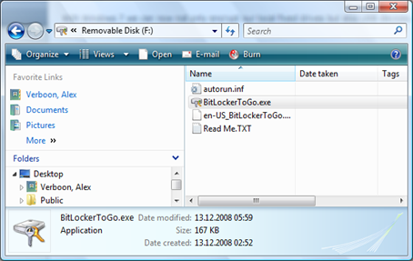
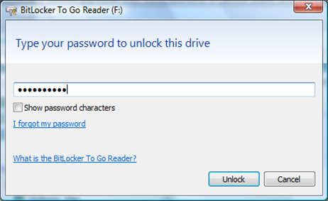
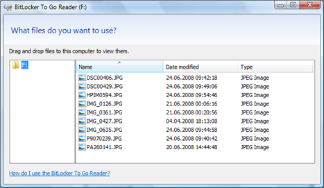

With Windows 7 we can not only encrypt our local fixed drives but also USB devices. Considering that probably many of do carry around one or more memory sticks that could contain sensitive data or just data you don’t want anyone else to get access too. 

  Now of course any new operating system comes with tons of new features, but I would consider this as one of those features that people are also really going to use, as it simple to use. 

  Encrypting a USB memory stick within Windows 7 is a matter of a few clicks, the process is very intuitive and self-explaining. Once you have a USB memory stick attached to your system, simply select the device in Windows Explorer and select “Turn on Bitlocker” in the context menu. 

  What makes the Windows 7 USB device encryption even more useful is that you cannot only use that encrypted device on a Windows 7 system, but also on Windows Vista (don’t know if also on XP as I am to lazy to try that out right now). 

  When you insert a Windows 7 encrypted USB device to a Windows Vista client, you will only see the following content on the device. 

   

  To access the encrypted data, you must launch the BitLockerToGo.exe

   

  Enter your previously set password, then you’re ready to browse the content of the device. 

   

  If you want to remove encryption from your USB device, you must start the Bitlocker Drive Encryption applet within the Control Panel and select “Turn off Bitlocker”. 

  More about Windows 7 Bitlocker:

  [Windows 7 Screencast - BitLocker To Go](http://edge.technet.com/Media/Windows-7-Screencast-BitLocker-To-Go/)        

  [BitLocker in Win7](http://edge.technet.com/Media/BitLocker-in-Win7/)          

  [Bitlocker Screencast](http://edge.technet.com/Media/Bitlocker-Screencast/) (for those interested in history)

  [TechNet – Bitlocker area](http://technet.microsoft.com/en-us/windows/aa905065.aspx)

  [TechNet Radio: BitLocker](http://edge.technet.com/Media/TechNet-Radio-BitLocker/) (January 2009)

