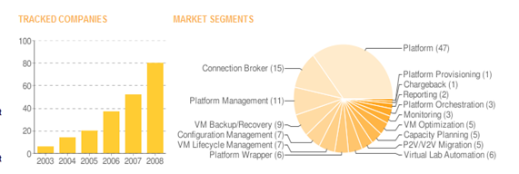

Just came across this nice “[Virtualization Industry Radar](http://www.virtualization.info/radar/)” page. The page provides a nice overview of the key players within the virtualization industry. 

   

  Copyright © 2003-2009 [virtualization.info](http://www.virtualization.info)

