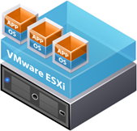

Need to prepare a presentation for a VMWare based Solution ? Then check out the VMWare icons and diagrams collection on the VMWare viops [site](http://viops.vmware.com/home/docs/DOC-1338). Download the Power Point file with all icons and diagrams [here](http://viops.vmware.com/home/servlet/JiveServlet/download/1338-2-1994/PPT_Library_VMware_icons-diagrams_Q109_FINAL.ppt). Those that want to go into more detail might find [this source](http://communities.vmware.com/viewwebdoc.jspa?documentID=DOC-9441&communityID=2414) useful as well. 

   

   

  And those that work with Visio might be interested in the [Virtualization stencils](http://www.vmguru.com/index.php/component/attachments/download/1) from [vmguru.com](http://www.vmguru.com/)

