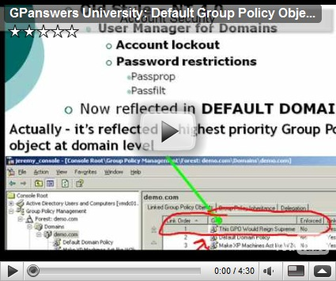
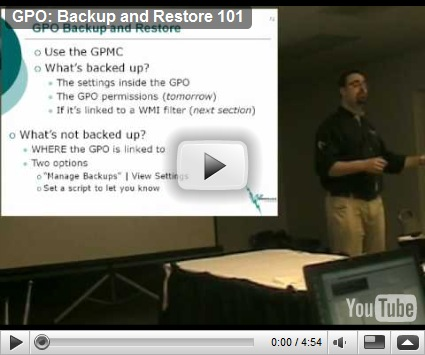

Jeremy Moskowitz from [GPanswers.com](http://www.GPanswers.com/1.html?p=cpqalve&w=HOME) has posted 2 **free** [GPUniversity](http://www.GPanswers.com/1.html?p=cpqalve&w=SMART) videos.  

  **Default Group Policy Objects**

      

  ****

  **Group Policy Backup and Restore**

      

  Interested in more ? Check out the [Group Policy Online University](http://www.GPanswers.com/1.html?p=cpqalve&w=SMART).

