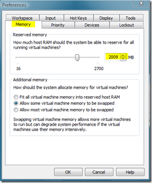

One of the key hardware related prerequisites when using Virtualization software is RAM. To improve performance of my virtual environment that I have running on my notebook, I had ordered an additional memory module of 2 GB RAM. 

  After having added the additional 2 GB of RAM i started the VMWare Workstation and booted the Windows 7 and  Windows Server 2003 guest systems. Before starting these I had of course raised the assigned amount of memory for each guest system. 

  To my surprise performance did not significantly improve, even worse there was a lot of disk activity due to memory swapping (as I found out afterwards). 

  To keep the story short, what seemed to have happened is that VMWare Workstation did not take notice of the increased amount of RAM, and therefore the Memory configuration within VMWare Workstation was still configured based on the previously available amount of memory. After having adjusted the Memory configuration, performance was greatly improving. 

  

