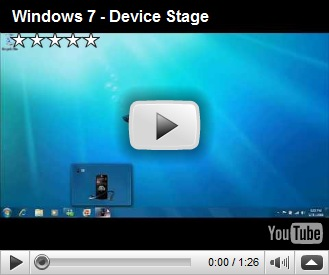

Another great feature that will come with Windows7 is Device Stage.

  Watch the video below and read the “[Device Stage – A New Way of Interacting with Devices in Windows 7](http://windowsteamblog.com/blogs/windowsexperience/archive/2009/01/08/device-stage-a-new-way-of-interacting-with-devices-in-windows-7.aspx)” on the [Windows Blog](http://windowsteamblog.com/) to learn more about device stage.

     

  Personally I am interested how device stage can be used within an enterprise environment. I hope Microsoft is going to add some manageability functions for Device Stage.

