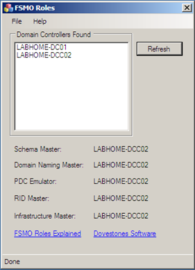

In preparation of doing some Group Policy related things, I decided to extend my Home Lab AD infrastructure running on Windows Server 2003, with  Windows Server 2008 and Windows Server 2008R2 domain controllers. 

  Because at some stage I want to get rid of the Windows 2003 Server I also moved the FSMO roles from the Windows 2003 domain controller to the Windows 2008 domain controller. 

  I used the steps described in the “[Transferring FSMO roles](http://www.petri.co.il/transferring_fsmo_roles.htm)” article. Additional information can also be found in the “[How to view and transfer FSMO roles in Windows Server 2003](http://support.microsoft.com/kb/324801)” article. 

  By searching documentation on how to move FSMO roles, I found the [FSMO Roles](http://www.dovestones.com/active-directory/FSMORoles.html) utility from [dovestones software](http://www.dovestones.com/),, that simply shows you who owns the FSMO roles within your current AD infrastructure.  

   

  Those who prefer scripts use the code described in “[How to Find the FSMO Role Owners Using ADSI and WSH](http://support.microsoft.com/kb/235617)”.

