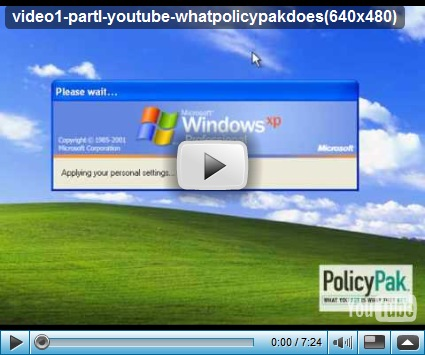

Group Policies and Group Policy Preferences are great technologies to manage your enterprise desktops. But what if you want to go beyond the features Microsoft has build into the Group Policy Management Console?

  With [PolicyPak](http://www.policypak.com/) you can consistently manage ANY application’s settings using the Windows native Group Policy technology. have a look at the PolicyPak introduction video below to learn what PolicyPak can do and how it works. 

     

  Learn more about [PolicyPak](http://www.policypak.com/) and watch the [video tutorials](http://www.policypak.com/support-and-sharing/video-tutorials). 

   

  Other resources

  [Group Policy Preferences Overview](http://www.gpoguy.com/Portals/0/Group%20Policy%20Preferences%20Overview.pdf) 

  [Microsoft Group Policy site](http://technet.microsoft.com/en-us/windowsserver/grouppolicy/default.aspx)

  [TechNet Magazine - Expanded Control with Group Policy Preferences](http://technet.microsoft.com/en-us/magazine/dd314380.aspx)

  [Group Policy Settings Reference for Windows Server 2008 and Windows Vista SP1](http://www.microsoft.com/downloads/details.aspx?familyid=2043B94E-66CD-4B91-9E0F-68363245C495&displaylang=en)

