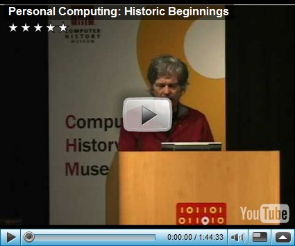

While usually we focus on what is happening today and what might come tomorrow, it’s quite interesting to look back in a while and learn how we actually got there.  

  By searching the web for historical tech content, I came across the website of the [computer history museum](http://www.computerhistory.org/) located in Mountain View – California. 

  I then found this very interesting video “Personal Computing: Historic Beginnings” presented by [Alan Kay](http://en.wikipedia.org/wiki/Alan_Kay). The presentation is about 110 minutes long, but definitely worth looking at if you’re interested in the history of personal computing. 

     

  

  Nowadays remote controlling devices and sharing documents is something we do almost every day and has become a standard task in working with computer devices. But if I were to tell you that this was already possible in 1968, would you believe that? If not, then watch “[The Demo](http://sloan.stanford.edu/MouseSite/1968Demo.html)” presented by [Douglas C. Engelbart](http://en.wikipedia.org/wiki/Douglas_Engelbart).

