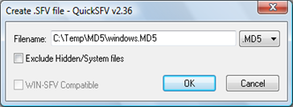
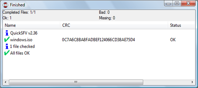

Today we once more ran into an issue caused by a corrupted file transfer. I mention “once more” because this is something I see happening all the time. So let me drop a couple of words on this. 

  When putting content on an FTP site consider creating a checksum file as this will allow others to validate their file downloads. Just comparing file size is not enough (examples follow). 

  There are many freeware tools that can create and verify checksum files. One of the tools we are using is [QuickSFV](http://www.quicksfv.org/index.html). What is nice about QuickSFV is that it is fast and can be fully integrated into the Windows Explorer context menu, allowing you to just select a file and create or verify a checksum file of it. 

  **Creating an MD5 checksum file**

  Mark the file or folder for which you wan to create a checksum file, then select “Create SFV file” from the Explorer context menu. 

   

  Note that by default an SFV file is being created, next to the filename you can toggle between SFV and MD5. 

  **Verifying files**

  Select the folder or file you just downloaded including the checksum file(s) and select “Verify individual file(s)” from the Explorer context menu. 

  If your content was checked successfully, you should see a status window as shown below. 

   

  **ZIP – RAR your content**

  When you need to transfer multiple individual files, it’s highly recommended that you compress these using WinZip, WinRAR or any other file compression utility before uploading them to your FTP server. The reason for doing this is because first it’s more convenient for others to just download one file and second it reduces the risk of individual files being corrupted during a file transfer. Usually when the transfer of a ZIP/RAR file was not successful, you can’t even open the archive, nevertheless I recommend creating a checksum file for archive files as well. 

  **My personal experiences with incorrect file downloads**

  The Microsoft Visio application that would never start correctly – Back in 2002 I was working on a project where i had to package Microsoft Visio. The customer had uploaded the original installation sources to our server, unfortunately he had not created an ISO file from the original product CD but had just copied all individual files from it. The application was packaged and we started testing. Although the application would install correctly, every time the application was started a very strange error message would pop-up. To keep the story short here, after 4 days of troubleshooting we decided to run a manual installation from the original product CD and guess what, it all worked as it should. We then compared the sources and found out that there was a difference in size for just “one” DLL file. 

  Incorrect OS installations – We have seen all kinds of strange behaviors with badly downloaded ISO files that contained customer OS images. Either the DVD wouldn’t boot at all, it hung during the WinPE boot, blue screened during the boot process or simply got hung up in the middle of the installation process. In “almost” every case, the root cause was related to a corrupted file download (or badly burned DVDs).

