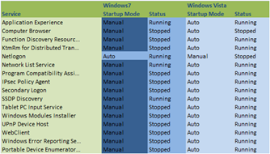
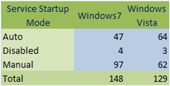

In part one of “[Windows Services, What changed from Vista to Windows7](https://www.verboon.info/index.php/2009/04/windows-services-what-changed-from-vista-to-windows7-part1/)”  I highlighted the new, renamed and removed services that come with Windows7. 

  Some Services are not quite new, but are now just installed by default. One example is the ActiveX Installer Service. 

  The below table lists those Services where the startup mode was changed from Automatic (Vista) to manual (Win7). 

   

  Note that the “Status” for some Services on your system might be different. The list was produced right after having installed both the  Windows Vista and Windows7 client within Hyper-V guest machines. 

  Looking at the table below, we see that in Windows7 less services are configured to start automatically. This is most likely one of the reasons why Windows7 shows improved boot times. 

  

