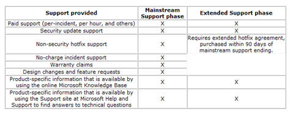

On April 14th mainstream support for Windows XP will end. for the next 5 years the operating system goes into extended support. The table below illustrates the differences between mainstream and extended support. 

  

  The Microsoft Windows XP product page explains it as following: 

  *Mainstream Support delivers complimentary and paid support, free security updates, and bug fixes to all Windows customers who purchase a retail copy of Windows XP (i.e., a shrink-wrapped, not pre-installed copy). Mainstream Support for Windows XP will continue through **April 2009.***

  *Extended Support delivers free security updates to all Windows customers. Customers can also pay for support on a per incident basis. Extended Support for Windows XP will continue until **April 2014**. New bug fixes require the Extended Hotfix Support program.* 

  More Information:

  [Microsoft Support Lifecycle Policy](http://support.microsoft.com/default.aspx/gp/lifepolicy)

  [Microsoft Support Lifecycle for Windows XP](http://support.microsoft.com/lifecycle/?p1=3223)

  [Microsoft Support Lifecycle for Windows 2000](http://support.microsoft.com/lifecycle/?p1=3071)

  [Microsoft Support Lifecycle for Windows Vista Enterprise](http://support.microsoft.com/lifecycle/?p1=11737)

