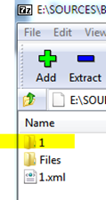
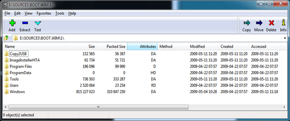

[7-Zip](http://www.7-zip.org/) is a free file archiver supporting many of today’s known archive formats such as ZIP, CAB, RAR and many more. Anyone who deals a lot with WIM files (Windows Image files) knows about the mount and un-mount commands and if you use imagex.exe and dism.exe on a regular basis you probably know the commands out of your head. 

  7-Zip also allows you to open, browse and extract content from a WIM file. This is especially helpful if you don’t have the imagex.exe or dism.exe installed. 

  When you open a WIM file with 7-Zip, you first get a list of the instances as shown in the picture below.

   

  Double click on the instance in which you want to browse or extract content from.

  

