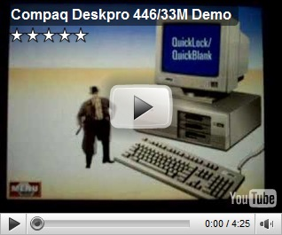

For those who read my blog, know that from time to time a like to look back in history. Today I've found the [Compaq](http://www.compaq.com/) Deskpro 486/33M Demo video. I remember well when we used these machines at our office. In fact Compaq had a very good concept in place in these days, allowing you to easily upgrade individual parts like the processor or graphics board without the need to replace the entire unit.

  

  By the way Compaq is not dead. Since the brand has never lost its popularity, HP still sells hardware branded with Compaq. Just the logo changed a bit.

  

